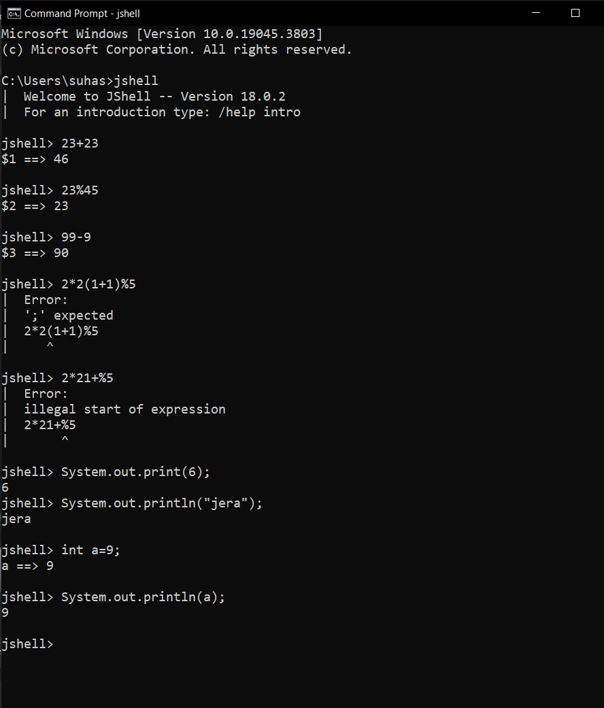
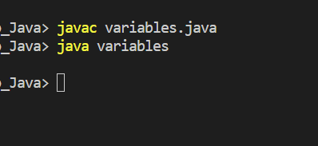

#  JShell
The `Java Shell tool (JShell)` is an interactive tool for learning the Java programming language and prototyping Java code. JShell is a `Read-Evaluate-Print Loop (REPL)`, which evaluates declarations, statements, and expressions as they are entered and immediately shows the results. The tool is run from the command line.

### How to run java code in cmd
